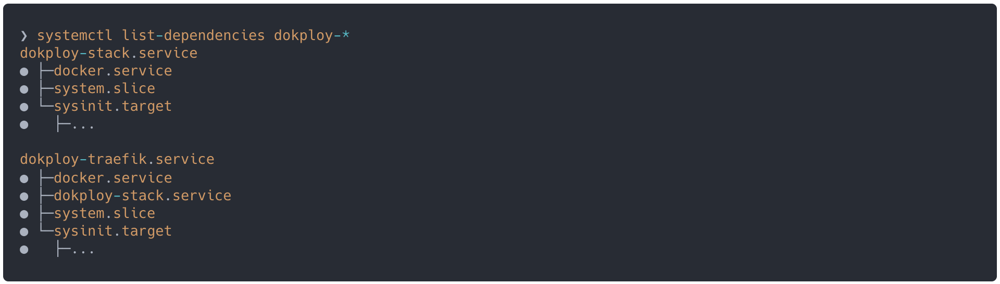
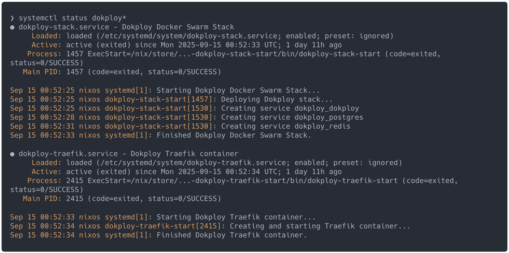
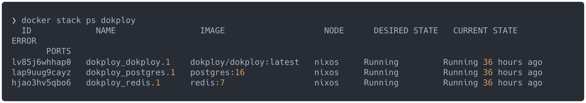

# nix-dokploy

[](https://github.com/el-kurto/nix-dokploy/actions/workflows/build.yml)

A **NixOS module** that runs [Dokploy](https://dokploy.com/) (a self-hosted PaaS / deployment platform) using declarative systemd units.

⚠️ This module is **NixOS-only**. It integrates directly with `systemd.services` and `systemd.tmpfiles`, so it will not work on nix-darwin, home-manager, or plain nixpkgs environments.

## ✨ Features

- `dokploy-stack.service` and `dokploy-traefik.service` systemd units
- Proper service ordering (`docker.service` → `dokploy-stack.service` → `dokploy-traefik.service`)
- Automatic state directory creation via `systemd.tmpfiles`
- Clean `ExecStop` + `ExecStopPost` handling (containers removed on stop/restart)
- No reliance on upstream shell scripts





## 🚀 Usage

Add the input to your `flake.nix`:

```nix
{
  inputs = {
    nixpkgs.url = "github:NixOS/nixpkgs/nixos-unstable";
    nix-dokploy.url = "github:el-kurto/nix-dokploy";
  };

  outputs = { self, nixpkgs, nix-dokploy, ... }: {
    nixosConfigurations.my-server = nixpkgs.lib.nixosSystem {
      modules = [
        nix-dokploy.nixosModules.default
        {
          virtualisation.docker.enable = true;
          virtualisation.docker.daemon.settings.live-restore = false;
          services.dokploy.enable = true;
        }
      ];
    };
  };
}
```

## 📋 Notes

- Requires docker
- Rootless docker not supported due to swarm usage
- Docker live-restore must be disabled due to swarm usage

## ⚙️ Configuration

```nix
services.dokploy = {
  enable = true;
  dataDir = "/var/lib/dokploy";  # Default
  dokployImage = "dokploy/dokploy:latest";  # Default
  traefik.image = "traefik:v3.1.2";  # Default
};
```
